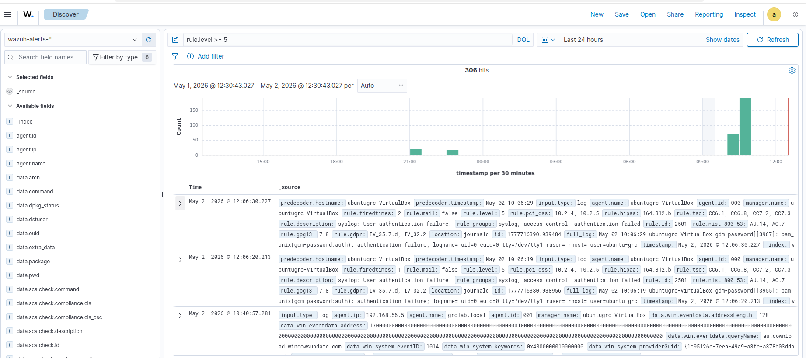

# 🛡️ Wazuh AI SOC Agent

### SIEM-Based Threat Detection & Incident Response Lab

---

## 🇩🇪 Projektbeschreibung

Dieses Projekt demonstriert den Aufbau einer realistischen **SOC-Umgebung (Security Operations Center)** unter Verwendung von:

* Wazuh SIEM
* Kali Linux
* Windows Server 2022
* Python (AI-Agent)

Ziel ist es, Sicherheitsvorfälle automatisch zu erkennen, zu analysieren und in Form von strukturierten Incident Reports zu dokumentieren.

---

## 🇬🇧 Project Description

This project demonstrates the implementation of a realistic **SOC (Security Operations Center)** environment using:

* Wazuh SIEM
* Kali Linux
* Windows Server 2022
* Python (AI Agent)

The goal is to automatically detect, analyze, and document security incidents in structured incident reports.

---

## 🔧 Technologien / Technologies Used

* Wazuh SIEM
* Kali Linux (Attack Simulation)
* Windows Server 2022 (Target System)
* Python (Automation & AI Agent)
* MITRE ATT&CK Framework
* pfSense Firewall
* GitHub (Documentation & Version Control)

---

## 🏗️ Lab-Architektur / Lab Architecture

* Ubuntu Server → Wazuh Manager
* Windows Server → Target System
* Kali Linux → Attack Simulation
* pfSense → Firewall & Network Monitoring
* Python Agent → Alert Analysis & Reporting

---

## 🔄 Workflow / Ablauf

1. Angriff wird von Kali Linux gestartet
2. pfSense überwacht und protokolliert Traffic
3. Wazuh erkennt das Ereignis
4. Alert wird gespeichert (`alerts.json`)
5. Python-Agent analysiert die Logs
6. Incident Report wird erstellt

---

## 🚨 Beispiel-Szenario / Example Scenario

* Durchführung eines Port-Scans mit Nmap (Kali Linux)
* Erkennung durch Wazuh SIEM
* Klassifizierung durch AI-Agent
* MITRE ATT&CK Mapping (z. B. T1110 – Brute Force)
* Generierung eines Incident Reports

---

## 📊 Ergebnisse / Results

* Automatische Erkennung von Sicherheitsereignissen
* Klassifizierung nach Schweregrad (LOW → CRITICAL)
* MITRE ATT&CK Mapping
* Generierung von Incident Reports
* Export von Audit-Evidence (CSV)

* 
---
## 📊 Wazuh SIEM Detection



*Wazuh detecting security events based on rule severity (rule.level ≥ 5).*
---

## 📁 Projektstruktur / Project Structure

```
agent/          → Python SOC Agent  
reports/        → Generated Incident Reports  
evidence/       → CSV Audit Logs  
docs/           → Documentation  
screenshots/    → Proof of Implementation  
```


## 🎯 Ziel / Objective

Dieses Projekt simuliert reale SOC-Prozesse und dient als Nachweis praktischer Kenntnisse in:

* SIEM Monitoring
* Incident Response
* Threat Detection
* Network Security (pfSense)
* GRC & Compliance (ISO 27001 / NIST)

---

## 👨‍💻 Autor / Author

**Christian Chukwuka**
Cybersecurity & IT Audit Enthusiast
